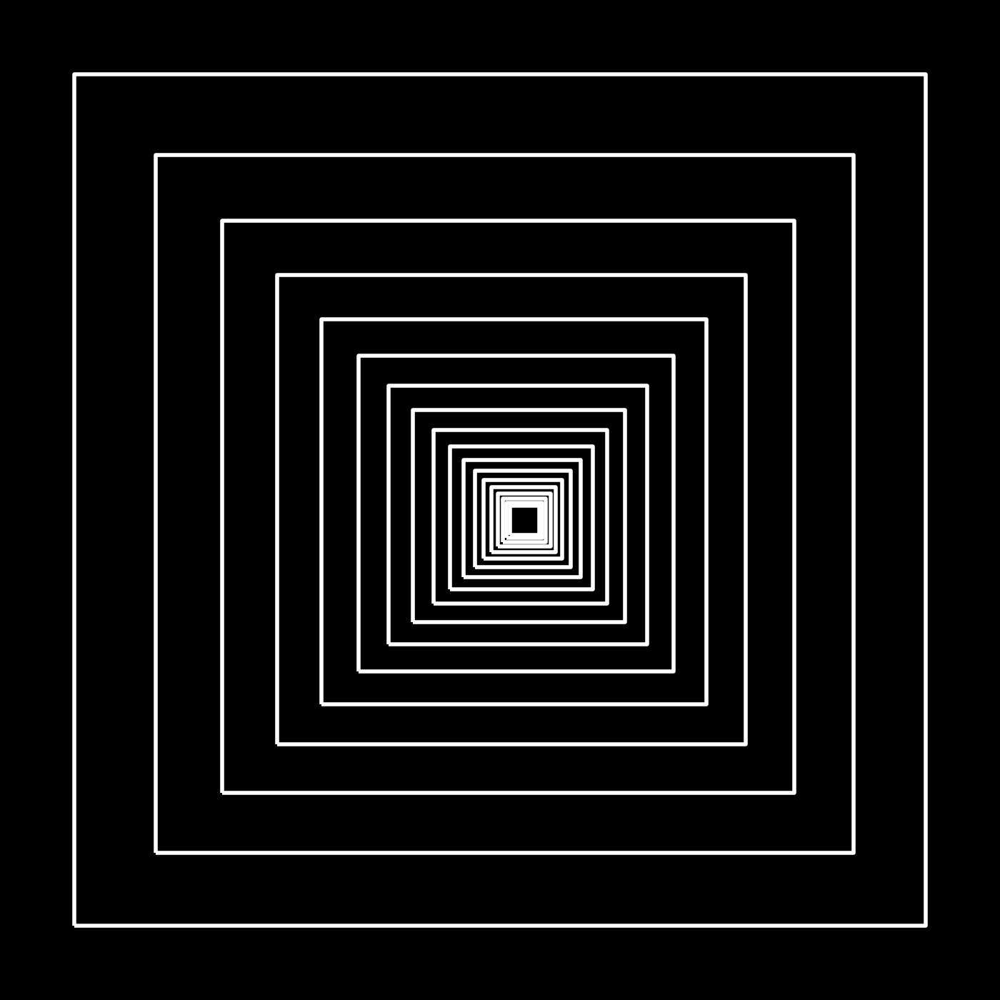

# Nested Squares Tunnel Illusion

A generative art script that renders a fractal-style "tunnel" illusion made of
progressively smaller, off-center square outlines — inspired by classic Op Art
(square) tunnel designs.

## Fractal Type(s) Implemented

- **Nested Squares / Square Tunnel Illusion** — a self-similar sequence of
  square outlines, each geometrically scaled down and shifted toward an
  off-center vanishing point. The geometric (rather than linear) shrinkage
  and off-center convergence point are what create the illusion of a tunnel
  receding into the distance.

## Tools, Languages, and Libraries Used

- **Language:** Python 3
- **Libraries:**
  - [NumPy](https://numpy.org/) — coordinate/array math
  - [Matplotlib](https://matplotlib.org/) — rendering and image export

## Setup and Run Instructions

1. **Clone the repository**
   ```bash
   git clone <your-repo-url>
   cd <your-repo-folder>
   ```

2. **Install dependencies**
   ```bash
   pip install numpy matplotlib
   ```

3. **Run the script**
   ```bash
   python nested_squares.py
   ```

4. **View the output**
   The script generates `nested_squares.png` in the same directory.

### Customization

Open `nested_squares.py` and adjust the parameters passed to
`draw_nested_squares()`:

| Parameter | Description |
|---|---|
| `outer_half_size` | Size of the outermost square |
| `n_squares` | How many nested squares are drawn |
| `shrink_ratio` | How much smaller each square is than the last (closer to 1 = slower shrink) |
| `vanish_offset` | Offset of the vanishing point from center, as a fraction of `outer_half_size` — `(0, 0)` gives perfectly concentric squares |
| `color` / `lw` | Line color and thickness |

## Screenshot



## Author

- **Name:** Muhammad Haris Aziz
- **Registration Number:** 552577
